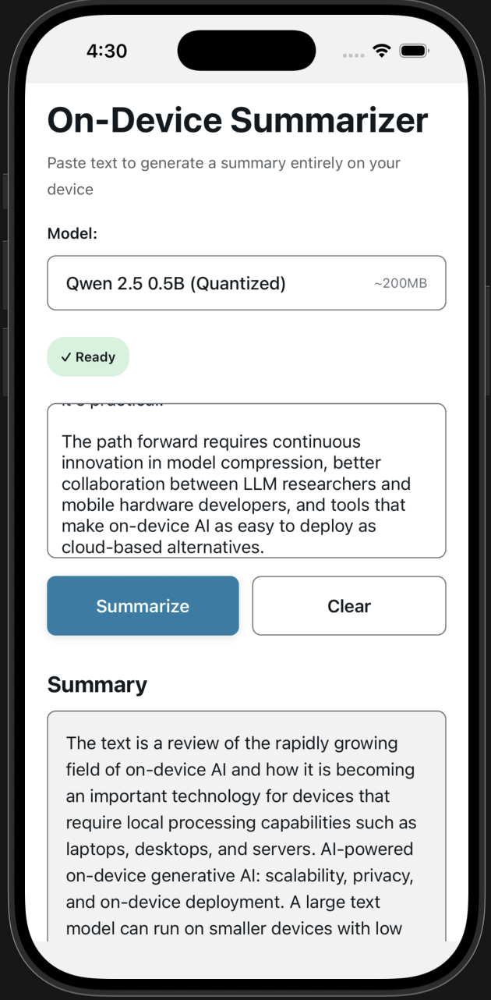

# AI Beyond the Cloud: The Current and Future State of On-Device Generative AI

**Tags:** `ai` `mobile` `react-native` `engineering`

*Ruslan Bredikhin • 10 Nov 2025*

---

Stop paying for every token. Seriously. On-device LLMs deliver enterprise AI functionality with zero cloud costs and guarantee total user privacy by running entirely on the device.

The shift to on-device AI is real. Yes, cloud-based AI makes sense for training, but when it comes to using mobile devices for inference, the economics and privacy implications are starting to make it look way less attractive.

Of course, you won't be able to get the same performance from those on-device models just yet, but on-device GenAI is rapidly maturing. The demand for secure, fast AI-driven experiences is driving this. The future relies on continuous innovation in model compression and better collaboration between LLM researchers and mobile hardware developers. We need to overcome resource barriers and boost mobile adoption, and with everything that is happening in the industry over the recent years, that does seem achievable.

This isn't just theory though. We'll walk through three critical areas: privacy and cost efficiency, hardware limitations we're solving, and how RAG makes local LLMs actually useful. Then we'll show you a working demo we built that summarizes text entirely on-device.

## Privacy and Cost Efficiency of Local LLM Deployment

### Privacy by Design: Your Data Never Leaves the Device

Benefits of using on-device AI in terms of privacy are pretty obvious: on-device deployment ensures that the user data, which may include sensitive information, never leaves the device. All processing is handled locally. No API calls to external services, no data sitting in someone else's infrastructure. All clean.

That said, keep in mind that this architecture can be modular. You can connect to a trusted server-side knowledge base for proprietary data while still using the local LLM for generation. Private data that matters, which includes user queries and personal context, stays local. Enterprise data stays in your control.

In practice, you're running LLM inference on-device while querying your internal knowledge base via secure API, and the sensitive portion of the data (what the user is asking and how they're asking it) always stays on the device. General knowledge? That can be under your control as well.

### Zero Cost and Scalability

The economics are simple: local deployment eliminates the need for expensive cloud servers required for AI processing. No per-token charges, no scaling headaches when usage spikes.

The system scales effortlessly to millions of users because processing is handled on the client side. Each device does its own work. When you launch a new feature, you don't suddenly need to provision more GPU instances or negotiate new API rate limits.

As for the offline capability, it can be considered a bonus nobody talks about enough. Users in poor connectivity areas, or working with sensitive data that can't leave the network, still get full AI functionality. Good luck trying to do that with a cloud-based setup.

The catch? On top of obvious limitations like reduction in capability and restricted access to resources like web or MCPs in offline mode, you're trading server costs for challenges like battery life and device temperature fluctuations. However, as we'll see further, those are all solvable.

## Overcoming Mobile Hardware Limitations Through Optimization

### The Energy Consumption Problem

Deploying LLMs on mobile devices faces a fundamental challenge: substantial energy consumption that rapidly depletes battery life. Running high-demand scenarios like 20 iterations of large prompts, for example, [can cause a 16% mean battery level delta](https://ijsea.com/archive/volume13/issue4/IJSEA13041008.pdf) on a typical device.

Mobile devices [lack the thermal management systems for continuous, high-intensity computation](https://arxiv.org/html/2410.03613v1). Your phone gets hot. Performance throttles. Users notice and complain, unfortunately.

Testing across various devices reveals a consistent pattern. Small models (under 1B parameters) are manageable, but scale up and you [hit thermal and power limits quickly](https://ithy.com/article/hardware-requirements-7b-llm-smartphones-zn83cgyg). CPU and GPU heat up, the device throttles to protect itself.

### Model Optimization Through Quantization

One technique to tackle the challenges related to using LLMs on mobile devices is model optimization through quantization. [Quantization](https://symbl.ai/developers/blog/a-guide-to-quantization-in-llms/) is where the magic happens. It's the process of converting model weights from high-precision floating-point numbers (like FP32 or FP16) to lower-precision integers (like INT8 or INT4). FP32 uses 32-bit full precision with each parameter taking 4 bytes, FP16 uses 16-bit half precision taking 2 bytes, while lower-precision formats such as INT8 (1 byte) or INT4 (0.5 byte) [reduce storage significantly](https://labelyourdata.com/articles/llm-fine-tuning/llm-model-size). By reducing the precision of model parameters, we shrink model size dramatically. For example, a 7B parameter model that would typically occupy about 28 GB at FP32 precision [drops to 14 GB at FP16, 7 GB at INT8, and just 3.5 GB at INT4](https://www.byteplus.com/en/topic/464549). Going from FP32 to INT8 makes the model 4× smaller, while INT4 quantization achieves an 8× reduction. This massive size reduction enables LLMs to run on resource-constrained devices, with INT8 models running faster and using 4× less memory with only minor accuracy loss, and INT4 methods like QLoRA demonstrating [approximately 99% of the original model's performance](https://rumn.medium.com/unlocking-efficiency-a-deep-dive-into-model-quantization-in-deep-learning-b0601ec6232d).

But size reduction is just part of it. The real win is computational efficiency.

INT8 quantization achieves a 40% reduction in computational cost and power consumption compared to FP16. INT4 quantization pushes that to 65% reduction. On edge devices, INT4 configurations show 4x throughput increases and cut power consumption by 60%.

These aren't theoretical numbers. [Hardware evaluations](https://mlcommons.org/en/inference-edge-21/) on actual mobile devices confirm it. The trade-off is a slight quality degradation, but for most use cases, the precision loss is negligible: you're getting 95% of the quality with a fraction of the cost.

It's worth noting that quantization isn't just for small language models. True LLMs—models with billions of parameters—benefit significantly from quantization as well. The same size and efficiency gains apply, making even large models viable for on-device deployment where they would otherwise be impossible to run.

However, when it comes to quantization, choosing the right quantization strategy definitely matters. Text summarization works great with INT4. More complex reasoning tasks benefit from INT8. That's the sweet spot for most production deployments.

### Thermal and Performance Considerations

Even with quantization, thermal management matters. Short bursts of inference work great. Continuous generation over minutes requires smart chunking and giving the device time to cool.

In the demo we built (more on that below), we process text in chunks and insert small delays between operations. Battery life matters, but it's also about maintaining consistent performance without triggering thermal throttling. Once throttling kicks in, everything slows down.

## The Functional Enhancement of Retrieval-Augmented Generation (RAG) and Integration

### Improved Output Quality and Relevance

RAG [improves the quality of an LLM's responses](https://research.ibm.com/blog/retrieval-augmented-generation-RAG) by supplementing the model with relevant information retrieved from a local knowledge base. Accuracy matters, but so does relevance and context.

With local RAG, the model generates answers that are accurate, relevant, helpful, because it has access to domain-specific information. It doesn't need to rely solely on training data, which might be outdated or generic. This makes a real difference in production.

### Structured Generation Workflow

The process is straightforward:

1. **Question**: User query comes in
2. **Retrieve**: Search the local knowledge base for relevant context
3. **Augment**: Create a context-rich prompt combining the query and retrieved information
4. **Generate**: LLM produces the context-aware final answer

What's interesting is how this maps to mobile constraints. The knowledge base can be pre-indexed and stored locally. Retrieval happens fast because it's just [vector similarity search](https://www.pinecone.io/learn/vector-database/) on embedded documents. The LLM then generates using that enriched context.

We're not talking about internet-scale search here. We're talking about a curated knowledge base that not only contains your company docs, product information, user manuals, but also fits on the device and gets queried in milliseconds.

### Seamless On-Device Integration

The on-device LLM ecosystem is maturing with impressive speed. Libraries like `react-native-executorch` (which we use in this demo) enable LLM execution on-device using [PyTorch's ExecuTorch](https://pytorch.org/executorch/) runtime. Other options like `react-native-ai` provide compatibility with engines like [MLC LLM](https://mlc.ai/mlc-llm/) and the [Vercel AI SDK](https://ai-sdk.dev/docs/introduction).

For iOS 18+, [Apple Foundation Models](https://developer.apple.com/machine-learning/) provide Instant AI features natively. Text generation, embeddings, transcription, and speech synthesis—all on-device, all using system-level APIs.

The integration story is getting better. A year ago, getting an LLM to run on-device required custom native code and significant optimization work. Now you can pull in a library and have basic inference working in an afternoon.

The demo we built uses `react-native-executorch` with a quantized model. It's a React Native app (check out the code in this repo) that takes pasted text and generates a summary entirely on-device. No API calls. No cloud infrastructure. No per-request costs.

### Building the Demo: Text Summarization

The demo application [in this repository](https://github.com/nearform/ai-beyond-the-cloud) demonstrates on-device summarization. Users paste text directly, and the app processes it locally and generates a summary using an on-device LLM.

  

Architecture-wise, it's similar to the expo-stt-blog example (which does speech-to-text with Whisper), but instead of speech recognition, we're doing text summarization. The model runs entirely on-device, using optimized quantized weights. Inference stays fast and power-efficient.

Key implementation details:
- Text chunking for long documents (respects context windows)
- Local vector embeddings for RAG (if you want to add knowledge base features later)
- Progressive summarization for very long texts

  

The app allows switching between different models (see the [model registry](https://github.com/nearform/ai-beyond-the-cloud/blob/main/utils/model-registry.ts) in the repo), and our testing revealed some interesting trade-offs. The smallest model, `SMOLLM2_1_135M_QUANTIZED` at just 50MB, runs incredibly fast but doesn't produce the best results. On the other end, going for the biggest model like `LLAMA3_2_3B_SPINQUANT` quickly leads to memory issues on many devices. From our experience, `QWEN2_5_0_5B_QUANTIZED` (~200MB) produces the most balanced result—good quality output with reasonable performance and memory usage.

  

You can try it yourself: clone the repo, install dependencies, run `npm run ios` or `npm run android`. Works on iOS and Android. Everything happens on the device.

## Conclusion

The future of mobile intelligence may vert well lie in the on-device first philosophy since even advanced features like Retrieval-Augmented Generation (RAG) can be run locally, ensuring privacy and resulting in zero cost by avoiding cloud server reliance.

Running Large Language Models (LLMs) on mobile devices may be challenging, especially with substantial energy consumption and battery life issues being real concerns. However, developers manage to find ways to overcome this. With optimization techniques like quantization, we can shrink model size by up to 68% and cut computational costs by up to 65%, which in its turn means that powerful, complex AI systems are now viable on average smartphones.

Hardware is getting better. Tooling is maturing. Economics are shifting in favor of local execution.

We're not at the point where every mobile app needs its own LLM. But for use cases where privacy, cost, or offline capability matter, on-device AI is already the right choice. The demo in this repo shows it's not just possible, it's practical.

The path forward requires continuous innovation in model compression, better collaboration between LLM researchers and mobile hardware developers, and tools that make on-device AI as easy to deploy as cloud-based alternatives.

